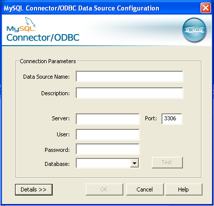

-   [Introduction](#introduction)
-   [Requirements](#requirements)
    -   [Software requirements](#software-requirements)
    -   [R-Packages](#r-packages)
-   [Install and uninstall](#install-and-uninstall)
    -   [Install](#install)
    -   [Uninstall](#uninstall)
-   [Connection to a database](#connection-to-a-database)
    -   [Connect to MS-Access db](#connect-to-ms-access-db)
    -   [Connect to mariadb db](#connect-to-mariadb-db)
-   [Running the ACD-App](#running-the-acd-app)
-   [CLIMSOFT](#climsoft)
    -   [Create Map](#create-map)
    -   [Create Table](#table)
    -   [Create Plots](#plots)
    -   [Create Report](#report)
    -   [Database Overview](#overview)
    -   [Download data](#download-data)
    -   [Set up User rights](#set-up-user-rights)
-   [LOCAL\_FILE](#local_file)
-   [References](#references)
-   [Annex 1](#annex-1)

<!-- Set up "columns" section -->

Introduction
============

The *Analysis of Climate Data Application* (ACD-App) has been developed
under the SASSCAL initiative (<http://www.sasscal.org>) through the
Climate Task *Historical and ongoing climate data management* to
facilitate the visualization of climate data in the meteorological
services of Angola, Botswana and Zambia.

The App was conceived to facilitate the interaction with climate data
stored in CLIMSOFT (<http://www.climsoft.org>), a Climate Data
Management System (CDMS) developed in Africa and installed in the
meteorological services of the SASSCAL countries. This App has been
improved over the years so that it currently allows the interaction with
climate data stored in ASCII files and create several climatic products.

The App provides specific features depending on the data source the user
is working with (either CLIMSOFT or a local file)

The tool has been developed under Shiny, an open source R package that
provides a powerful web framework for building web applications using R
(<https://shiny.rstudio.com/>). Shiny helps turn data analyses into
interactive web applications without requiring HTML, CSS, or JavaScript
knowledge ([RStudio, 2017](#references))

This manual will give an overview of the Application, explaining how to
install it, how to run it and how to use it.

Requirements
============

Software requirements
---------------------

The following software is required for the installation of the App:

-   Windows 7 or higher
-   Java SE Runtime Environment 7 or higher
    (<http://www.oracle.com/technetwork/java/javase/downloads/index.html>)
-   R v3.2.1 or higher (<https://cran.r-project.org/bin/windows/base/>)
-   RStudio v0.99.467 or higher
    (<https://www.rstudio.com/products/rstudio/download/>)
-   Rtools v.3.2 or higher
    (<https://cran.r-project.org/bin/windows/Rtools/>)
-   A web-browser, such as Mozilla-Firefox, Chrome or Internet Explorer
    (v.11 or higher)

Besides these this software, the App also requires additional programs
to be fully operational:

-   MikTeX (<https://miktex.org/>): To create `.pdf` files properly
-   Phantomjs (<http://phantomjs.org/>): To download leaflet maps as
    `.png` files in a proper way.
-   Pandoc (<http://pandoc.org/>): A universal document converter. It
    will be required to build up the help files.

If these programs are not available in the localhost, the App will
install them automatically. The following Table shows the default
versions that the App will install, as well as the links to the download
files. The user can install a later version of each program at any time.

<table>
<thead>
<tr class="header">
<th>Program</th>
<th align="left">Default version</th>
<th>Link to downloader</th>
</tr>
</thead>
<tbody>
<tr class="odd">
<td>MikTeX</td>
<td align="left">v2.9.6361-x64</td>
<td><a href="https://miktex.org/download" class="uri">https://miktex.org/download</a></td>
</tr>
<tr class="even">
<td>Phantomjs</td>
<td align="left">v2.1.1</td>
<td><a href="https://bitbucket.org/ariya/phantomjs/downloads" class="uri">https://bitbucket.org/ariya/phantomjs/downloads</a></td>
</tr>
<tr class="odd">
<td>Pandoc</td>
<td align="left">v1.19.2.1</td>
<td><a href="http://pandoc.org/installing.html" class="uri">http://pandoc.org/installing.html</a></td>
</tr>
</tbody>
</table>

R-Packages
----------

The ACD-App requires a number of R-packages to run properly. A R-package
is the fundamental unit of shareable code in R. A package bundles
together code, data, documentation, etc. and is easy to share with
others ([Wickham, 2017](#references)). Most of the packages required are
available on-line and will be installed automatically by the App.

    ## caTools
    ## cluster
    ## data.table
    ## DBI
    ## downloader
    ## DT
    ## dygraphs
    ## ggvis
    ## htmltools
    ## htmlwidgets
    ## installr
    ## leaflet
    ## mapdata

    ## openair
    ## plyr
    ## R.utils
    ## randomNames
    ## RCurl
    ## reshape2
    ## rhandsontable
    ## RJSONIO
    ## rmarkdown
    ## RMySQL
    ## RODBC
    ## rprojroot
    ## rtf

    ## shiny
    ## shinyBS
    ## tcltk
    ## uuid
    ## webshot
    ## XML
    ## xtable
    ## zoo

However, there are few packages developed specifically by SASSCAL that
are not available on the Internet but are required by the App. These
packages are included by default in the ACD-App folder, so that the App
can have access to them. These packages are:

    ## climssc
    ## data.from.climsoft.db
    ## get.plots.from.ftp

Certain packages are required in a specific version, or are not easily
downloadable from the Internet. These packages are included by default
in the `ACD-App` so that the App does not have to download them from the
Internet:

    ## lubridate rlang knitr

-   `lubridate` package (`v1.5.6.` required). It is used to easily
    handle dates and times, is a special case, since the App requires a
    specific version (v1.5.6). The package can be downloaded from the
    Internet, but the most recent versions are not compatible with the
    ACD-App.

-   `knitr` package (`v1.14` required). It is required by the
    `RMarkdown` package to create the documentation files properly. The
    package can be downloaded from the Internet, but the most recent
    versions are not compatible with the `RMarkdown`.

-   `rlang` package (`v.0.1.1` required). It is required by different
    packages but in the R repository is only available in its `source`
    form. Therefore, the App would not be able to download the
    `win.binary` file from the Internet.

The packages are saved in the following path:

    ## ACD_standalone/ACD_App/www/R_pkgs/win.binary

Install and uninstall
=====================

Install
-------

The Application is stored as a `.zip` file to reduce the size of it.
There are two different `.zip` files available:

-   `ACD_compact_small.zip` (approx. 12 Mb): Contains the minimum
    information to install the App. The user will **require Internet
    connection** to complete the installation, since the App will have
    to download the R-Packages from a R-CRAN repository (typically the
    repository: <http://cran.us.r-project.org>) and the required
    software (i.e. MikTeX, Phantom, Pandoc)

-   `ACD_compact_large.zip` (approx. 320 Mb): Contains all the
    R-Packages and software required for the installation of the App.
    The user will **not require Internet connection**.

To proceed with the installation, the user has to follow these steps:

1.  **Unzip file**: The user has to unzip the `ACD_compact_small.zip` or
    `ACD_compact_large.zip` file and place the content in any folder
    (e.g. `Desktop`, `Documents` or any other).

2.  **Open ACD\_standalone folder**: This folder contains all the
    information to install and run the App.

3.  **Edit file ACD.bat**: Right click on that file and select `Edit`.
    An editor will open the `.bat` file and the user can then modify the
    path where `R` is located. The default path is:

        ## C:/Program Files/R/3.2.1/bin/i386

    where `R-X.X.X` is the version of `R`, and `i386` contains the
    `32bit` version of `R`. Once the changes have been done, please save
    the changes and close the Editor.

4.  **Run ACD.bat:** Double click on the file. A command window will
    pop-up.

5.  **Select Meteorological Service**: The user will be asked to enter
    the meteorological service (either `DMS`, `INAMET` or `ZMD`). This
    information has to be entered only once.

Figure 1. Select the Meteorological Service

 

1.  **Download packages:** If the user uses the file
    `ACD_compact_small.zip`, then the App will download the required
    R-Packages automatically from an R-CRAN repository. Otherwise, the
    App will contain already the required packages. The packages will be
    saved in:

        ## ACD_standalone/ACD_App/www/R_pkgs/win.binary

    > ***Note:** This step may take some minutes. Please be patient.*

2.  **Unpack and install libraries:** Once the packages are saved
    locally, the App will proceed to unpack and install the packages as
    libraries. These libraries will be located in:

        ## ACD_standalone/ACD_App/www/libraries

    > ***Note:** This step may take some minutes. Please be patient.*

3.  **Download phantomjs:** If not available in the `ACD_standalone`
    folder, the exacutable file of `phantomjs` will be downloaded from
    the Internet.

4.  **Download and install Pandoc:** If not available in the
    `ACD_standalone` folder, the installer file of `Pandoc` will be
    downloaded from the Internet. Once the installer file is available,
    it will be run automatically so that the installation wizard pops
    up. The user will have to follow the steps of the wizard.

5.  **Download and install MikTeX:** If not available the
    `ACD_standalone` folder, the installer file of `MikTeX` will be
    downloaded from the Internet. Once the installer file is available,
    it will be run automatically so that the installation wizard pops
    up. The user will have to follow the steps of the wizard.

Once the installation process is finished, the `ACD-App` will open
automatically.

The App can be stopped at any time by closing the command window. To
re-run the App, execute the file `ACD_App.bat` again. The `ACD_App` will
then pop-up automatically.

Uninstall
---------

To uninstall the App, just remove the `ACD_standalone` folder.

Connection to a database
========================

If the ACD-App is going to be used to interact with a CLIMSOFT database,
it is necessary to set up a connection to that database. This has to be
done through the *Open Database Connectivity* Tool (ODBC), a standard
programming language middleware API (Application Programming Interface)
for accessing database management systems (DBMS). ODBC accomplishes DBMS
independence by using an ODBC driver as a translation layer between the
application and the DBMS.

The application uses ODBC functions through an ODBC driver manager with
which it is linked, and the driver passes the query to the DBMS. An ODBC
driver can be thought as analogous to a printer driver or other driver,
providing a standard set of functions for the application to use, and
implementing DBMS-specific functionality ([Wikipedia,
2017](#references)).

The ODBC will allow the ACD-App to identify and connect to the database
of interest. Therefore, an ODBC connection has to be set up. To do so,
it is necessary to follow these steps:

-   Make sure you have administrator rights, since the
    ODBC-Administration Tool can only be opened by the administrator.
-   Open the "ODBC-Administrator" by:

    -   Clickling on the `Start` menu button (bottom-left of the
        screen), `Control Panel`, then `Administrative Tools` and then
        `Data Sources (ODBC)` (Figure 1), or
    -   Running the file called: `odbcad32.exe` located in the folder:
        `C:/Windows/SysWOW64/`

Figure 2. Selection of `Administrative Tools` and `Data Sources (ODBC)`

 

Once opened, a Window that looks like Figure 3 will pop-up.

Figure 3. Window of Data Sources (ODBC)

 

-   Click on the `Add...` option and select one of the drivers listed.

Connect to MS-Access db
-----------------------

For connecting to `MS-Access db`, follow this steps:

-   Select the driver `Microsoft Access Driver (*.mdb, *.accdb)` and
    press `Finish`. (Figure 4)

Figure 4. Window 'Create new data source'

 

-   In the new Window (Figure 5), give a Data Source Name (DSN) to the
    connection and, if desired, add a description of such a connection.
    Please, make sure that the DSN contains the word **"CLIMSOFT"**
    (e.g. CLIMSOFT\_db). After that, select the database to connect with
    by pressing the button `Database: Select`.

Figure 5. Window to Setup the ODBC for MS-Access database

 

-   A new window pops-up (Figure 6) asks for the location of the
    database. Browse through your computer to find the location of the
    database (typically under `C:/Program Files (x86)/CLIMSOFT/dbase/`).
    Once the database has been selected, click `OK`.

Figure 6. Window to select the MS-Access database

 

-   Now it is necessary to set up the `System database`, since the
    CLIMSOFT databases join a Workgroup called `climsoft`. Therefore, it
    is necessary to locate the file `climsoft.mdw` that defines that
    Workgroup. For this, select the option `Database` within the
    `System Database` field. Then press the button `System database...`.
    This file is usually in the path `C:/Windows/System32/` or
    `C:/Windows/SysWOW64`.

Figure 7. Select the System Database

 

-   Once the file is selected, press `OK` to save changes and to close
    the `Select System Database` window, and press `OK` again to save
    the changes and close the `ODBC Microsoft Access Setup` Window.

Connect to mariadb db
---------------------

For connecting to a `mariadb db`:

-   Select the driver `MySQL ODBC X.X ANSI Driver`, where `X.X` refers
    to the version of the MySQL ODBC (e.g. `5.5`). If the MySQL driver
    is not available in the computer, it is possible to download it in
    <http://dev.mysql.com/downloads/connector/odbc/>.
    
    

    Figure 8. Example of a MySQL ODBC driver.
    

     

-   Fulfill the MySQL Connector Window (Figure 9) with the required
    information.
    -   Data Source Name (DSN): Name of the connection. Please, make
        sure that the DSN contains the word **"CLIMSOFT"** (e.g.
        CLIMSOFT\_db).
    -   Description: A brief description of the connection (it is
        optional),
    -   Server: Name of the server where the database is located.
        Usually it is `localhost`.
    -   Port: Port in which `mariadb` server is installed.
    -   User: User name that has to be used to connect to the
        `mariadb db`. (e.g. `root`).
    -   Password: Password of the user.
    -   Database: Select the database to which the connection should be
        done.
-   It is possible to test the connection by pressing the `Test` button.
    A message will pop up to say whether this connection has been
    successfull.

Figure 9. Window where to select the mariadb database

 

Running the ACD-App
===================

To run the application, just double click on the file `ACD-App.bat`.
After a few seconds, a web browser opens. The ACD-App interface appears
directly on the web-browser (see Figure 9). The application is ready to
use!

It can also be accessed from other computers connected to the Intranet.
To access to the ACD-App from another PC, open a browser (e.g. Mozilla)
and type the following Address:

    ## http://172.21.255.113:3182

The user has to select then on of the following source of data:

-   CLIMSOFT
-   DWD-ftp
-   LOCAL\_FILE

Figure 10. Data source available

 

CLIMSOFT
========

If the option `CLIMSOFT` is selected, the user will be asked to select
one type of database: `access` or `mariadb`.

Once one of both has been selected, a new field pops-up to select the
Data Name Source (DNS) of the database to which the user wants to
connect. Please notice that the options available are those DNS defined
previously in the ODBC Tool (see Section [Connection to a
database](#odbc)) After selecting the database the user will be asked to
log-in into the ACD-App prior any product can be created. The default
users available are:

-   `admin`: this user has full control of the ACD-App
-   `operator`: this user has restricted acces to the ACD-App. The
    default settings allows the `operator` to create maps, create plots,
    make metadata reports and get an overview of the database. By
    default he is not allowed to download any data.

The `admin` has the possibility of adding, removing or modifying the
user rights, as well as deleting or creating new user accounts.

The options available under `CLIMSOFT` are described below.

Create Map
----------

Creates a Map with the location of all the stations available in the
CLIMSOFT database. The information required to plot the station location
is stored in the CLIMSOFT database. If it is an `MS-access db`, then the
information is retrieved from the tables `station` and
`station_location`. If, instead, it is a `mariadb db`, the information
will be retrieved from the tables `station` and
`stationlocationhistory`.

It is an interactive map in which the user can select one station to
know its latitude and longitude, as well as its WMO id. By default, all
the stations are shown, but the user can filter the data by `authority`
(see legend on the right side). This is specially usefull if the
database has a lot of different data sources. Then the user can select
the data source(s) in which he is interested.

The map can also be download as a `.png` file.

Figure 11. Example of an interactive map

 

Create Table
------------

Once a station is selected on the Map, the user will be able to
visualize the data available for that station by selecting the
`Create Table` option. The displayed come from the tables `observation`
and `obs_element` in case of `MS-access db`, and `observationinitial`
and `obselement` in case of `mariadb db`.

The Table allows filtering the data since each column includes a filter
field below the header. Besides, the Table includes a `search` field to
facilitate the search of a specific parameter, date, etc.

If the user has the rights to download data, then he will be able to
download the Table in a `.csv` file.

Create Plots
------------

This option allows the user to plot the data available in the database.
The user can select one or more station, and one or more elements. The
user can select then one of the following type of graphics: `Histogram`,
`Timeseries`, `Timeseries_comparison` and `Windrose` (Similarly to what
has been described in the section [LOCAL\_FILE](#local_file)). Before
plotting, the user can also specify the date range. Examples of graphic
types available are shown below.

-   **Histogram**

<!--html_preserve-->

<nav class="ggvis-control">

<ul class="ggvis-dropdown">
<li>
Renderer:
<a id="plot_id952972998_renderer_svg" class="ggvis-renderer-button" onclick="return false;" data-plot-id="plot_id952972998" data-renderer="svg">SVG</a>
|
<a id="plot_id952972998_renderer_canvas" class="ggvis-renderer-button" onclick="return false;" data-plot-id="plot_id952972998" data-renderer="canvas">Canvas</a>
</li>
<li>
<a id="plot_id952972998_download" class="ggvis-download" data-plot-id="plot_id952972998">Download</a>
</li>
</ul>
</nav>

<!--/html_preserve-->

Figure 12. Example of an interactive Histogram

 

-   **Timeseries & Timeseries comparison**

Figure 13. Example of an interactive timeseries

 

-   **Windrose**

Figure 14. Example of windrose

 

Create Report
-------------

The ACD-App allows creating a `.pdf` report for a given location. This
report contains the main metadata related to the selected location(s).
It is neccessary to have `MikTeX` installed in order to run this option
properly. The App should be able to install the `MikTeX` program
automatically when it is run for the first time. The user can download
and install the program separately at any time
(<https://miktex.org/download>).

The Report includes the following information:

-   **Location:** A map with the location of the station(s) selected for
    the report.
-   **Metadata:** Information about the metadata of the station(s), such
    as station id, authority , begin and end date of measurements,
    longitude, latitude, height, and id alias.
-   **Elements available:** Availability of meteorological elements for
    the selected station(s). This includes the begin and end of the
    measurements for each element, the number of records expected, the
    actual number of records available in the database, and the
    corresponding estimated missing records (in per cent)

Database Overview
-----------------

This option has been included to get a quick overview of the data
available in the CLIMSOFT database. This Overview allows the user to see
the data availability organized by **Authority**, **Station** or
**Element** in an interactive table in which the user is able to filter
the results. The user can also download the overview data if he has the
rights to do so.

Download data
-------------

This option allows the user to make a data request to the database.
First, the desired station(s) have to be selected (it is possible to
select all the stations as well). Then the user can select the
element(s) and date range of interest. When these fields are fulfilled,
the button `Request Data` shows up. When pressing the button, a table
with the requested data will appear. These data can be also filtered by
the user using the filter fields placed just below the column headers.
If the user has the `Download` right, he will be able to download the
data in a `.csv` format. The download button is paced below the table.

Set up User rights
------------------

> ***Note:** Option only available for the `Administrator`*

The `Administrator` (default username: *admin*) can control the user
rights with this option. The rights that can be given are:

-   Map: If checked, the user will be able to create Maps (see [Create
    Map](#map) section).
-   Table: If checked, the user will be able to create a table with data
    of the station selected in the Map (see [Create Table](#table)
    section)
-   Plots: If checked, the user will be able to create Graphics (see
    [Create Plots](#plots) section)
-   Report: If checked, the user will be able to create a Report with
    Metadata of selected location(s) (see [Create Report](#report)
    section)
-   Overview: If checked, the user will be able to have an overview of
    the data stored in the database (see [Database Overview](#overview)
    section)
-   RClimDex: If checked, the user will be able to create different
    Climate Indices based on the R-Tool "RClimDex" (This option is
    currently deactivated)
-   User Rights: If checked, the user will be able to control the user
    rights of other users (it is highly recommended that only the
    `admin` has access to this option)
-   Download: If checked, the user will be able to, not only view the
    data, but also download data. The download of data will be then
    active within the following options:

    -   Create Table
    -   Create Plots
    -   Overview
    -   Download data

LOCAL\_FILE
===========

If the option `LOCAL_FILE` is selected, the user will be asked to select
one or more ASCII files with the data that the user wants to visualize.
The formats accepted are: `.txt` and `.csv`

The structure of the data stored in the file can be different but it has
to contain, at least, the following information:

-   Station identifier (e.g. `station_id`)
-   Date or datetime when the observation was done (e.g. `date`). In
    most cases, the App will be able to detected the date format
    automatically.
-   Name of the element(s) observed (e.g. `temp_max`)

The table below shows an example of an accepted file structure:

<table>
<thead>
<tr class="header">
<th align="right">station_id</th>
<th align="right">date</th>
<th align="right">temp_max</th>
</tr>
</thead>
<tbody>
<tr class="odd">
<td align="right">IDL001</td>
<td align="right">1880-01-01</td>
<td align="right">32.0</td>
</tr>
<tr class="even">
<td align="right">IDL001</td>
<td align="right">1880-01-02</td>
<td align="right">34.7</td>
</tr>
<tr class="odd">
<td align="right">IDL001</td>
<td align="right">1880-01-03</td>
<td align="right">32.7</td>
</tr>
<tr class="even">
<td align="right">IDL001</td>
<td align="right">1880-01-04</td>
<td align="right">33.2</td>
</tr>
<tr class="odd">
<td align="right">IDL001</td>
<td align="right">1880-01-05</td>
<td align="right">34.0</td>
</tr>
<tr class="even">
<td align="right">IDL001</td>
<td align="right">1880-01-06</td>
<td align="right">33.4</td>
</tr>
</tbody>
</table>

You can download a `.csv` file example
[here](../examples/localFile.csv).

Please, be aware that the ACD-App will only recognize the elements that
have a specific header. These headers are defined in the function
`ident_var` of the `climssc` package. You can find a list of default
headers used in package `climssc` in this
[file](../examples/default_labels.csv) or in [Annex 1](#annex1).

Once the file(s) have been selected, the App will try to recognize
automatically the elements available in the file(s), as well as the date
format. If it is not possible to detect these variables automatically,
the user will get a message explaining what the problem is.

If the App recognizes the structure of the file(s), then it will ask the
user to select one type of graphic. The options available are:
`Histogram`, `Timeseries`, `Timeseries_comparison` and `Windrose`.

Figure 15. Type of graphics available

 

Once the user has selected one of the options, just click OK and the
graphic(s) will be created (see Figure 16). The App allows the download
of the graphic, but also the download of the data.

Figure 16. Example of an interactive timeseries retrieved from a `.csv`
file

 

References
==========

ETCCDI/CRD (2017). *ETCCDI/CRD Climate Change Indices. Software*
<http://etccdi.pacificclimate.org/software.shtml> \[last accessed:
24.04.2017\]

RStudio (2017). *Easy web applications in R*.
<https://www.rstudio.com/products/shiny/> \[last accessed: 11.04.2017\]

Wickham (2017). *R Packages*. <http://r-pkgs.had.co.nz/intro.html>
\[last accessed: 12.04.2017\]

Wikipedia (2017). *Open Database Connectivity*.
<https://en.wikipedia.org/wiki/Open_Database_Connectivity> \[last
accessed: 11.04.2017\]

Annex 1
=======

<table>
<thead>
<tr class="header">
<th align="left">element.label</th>
<th align="left">default.label</th>
</tr>
</thead>
<tbody>
<tr class="odd">
<td align="left">Added_col</td>
<td align="left">Added variable</td>
</tr>
<tr class="even">
<td align="left">alt</td>
<td align="left">alt</td>
</tr>
<tr class="odd">
<td align="left">atmospheric_radiation</td>
<td align="left">atmospheric_radiation</td>
</tr>
<tr class="even">
<td align="left">capacity</td>
<td align="left">capacity_max</td>
</tr>
<tr class="odd">
<td align="left">cloudiness</td>
<td align="left">cloudiness</td>
</tr>
<tr class="even">
<td align="left">complete_dates</td>
<td align="left">complete_dates</td>
</tr>
<tr class="odd">
<td align="left">constructor</td>
<td align="left">constructor</td>
</tr>
<tr class="even">
<td align="left">convert_data</td>
<td align="left">convert_data</td>
</tr>
<tr class="odd">
<td align="left">count_over_threshold</td>
<td align="left">count_over_threshold</td>
</tr>
<tr class="even">
<td align="left">daily</td>
<td align="left">daily</td>
</tr>
<tr class="odd">
<td align="left">data_end_date</td>
<td align="left">data_end_date</td>
</tr>
<tr class="even">
<td align="left">data_name</td>
<td align="left">data_name</td>
</tr>
<tr class="odd">
<td align="left">data_start_date</td>
<td align="left">data_start_date</td>
</tr>
<tr class="even">
<td align="left">date_asstring</td>
<td align="left">date_asstring</td>
</tr>
<tr class="odd">
<td align="left">date</td>
<td align="left">date</td>
</tr>
<tr class="even">
<td align="left">date_list</td>
<td align="left">date_list</td>
</tr>
<tr class="odd">
<td align="left">date_time</td>
<td align="left">date_time</td>
</tr>
<tr class="even">
<td align="left">day</td>
<td align="left">day</td>
</tr>
<tr class="odd">
<td align="left">day_start_time</td>
<td align="left">day_start_time</td>
</tr>
<tr class="even">
<td align="left">dd</td>
<td align="left">dry_day</td>
</tr>
<tr class="odd">
<td align="left">dewpoint</td>
<td align="left">dewpoint</td>
</tr>
<tr class="even">
<td align="left">discharge</td>
<td align="left">discharge</td>
</tr>
<tr class="odd">
<td align="left">dm</td>
<td align="left">day_month</td>
</tr>
<tr class="even">
<td align="left">dos</td>
<td align="left">dos</td>
</tr>
<tr class="odd">
<td align="left">doy</td>
<td align="left">doy</td>
</tr>
<tr class="even">
<td align="left">dycld</td>
<td align="left">Day_with_cloud</td>
</tr>
<tr class="odd">
<td align="left">dyfog</td>
<td align="left">Day_with_fog</td>
</tr>
<tr class="even">
<td align="left">dyhail</td>
<td align="left">Day_with_hail</td>
</tr>
<tr class="odd">
<td align="left">dylgt</td>
<td align="left">Day_with_Lightningq</td>
</tr>
<tr class="even">
<td align="left">dyrain</td>
<td align="left">Day_with_rain</td>
</tr>
<tr class="odd">
<td align="left">dythnd</td>
<td align="left">Day_with_thunder</td>
</tr>
<tr class="even">
<td align="left">element_factor</td>
<td align="left">element_type</td>
</tr>
<tr class="odd">
<td align="left">end_date</td>
<td align="left">end</td>
</tr>
<tr class="even">
<td align="left">end_of</td>
<td align="left">end_of</td>
</tr>
<tr class="odd">
<td align="left">end_of_rain</td>
<td align="left">end_of_rain</td>
</tr>
<tr class="even">
<td align="left">evaporation</td>
<td align="left">evaporation</td>
</tr>
<tr class="odd">
<td align="left">extreme_event_day</td>
<td align="left">extreme_event_day</td>
</tr>
<tr class="even">
<td align="left">fresh_snow</td>
<td align="left">fresh_snow</td>
</tr>
<tr class="odd">
<td align="left">geopotential</td>
<td align="left">geopotential</td>
</tr>
<tr class="even">
<td align="left">global_radiation</td>
<td align="left">global_radiation_label</td>
</tr>
<tr class="odd">
<td align="left">identifier</td>
<td align="left">identifier</td>
</tr>
<tr class="even">
<td align="left">insolation</td>
<td align="left">insolation</td>
</tr>
<tr class="odd">
<td align="left">insolation_max</td>
<td align="left">insolation_max</td>
</tr>
<tr class="even">
<td align="left">insolation_min</td>
<td align="left">insolation_min</td>
</tr>
<tr class="odd">
<td align="left">insolation_percent</td>
<td align="left">insolation_percent</td>
</tr>
<tr class="even">
<td align="left">lat</td>
<td align="left">lat</td>
</tr>
<tr class="odd">
<td align="left">leaf_dryness</td>
<td align="left">leaf_dryness</td>
</tr>
<tr class="even">
<td align="left">leaf_wetness</td>
<td align="left">leaf_wetness</td>
</tr>
<tr class="odd">
<td align="left">lon</td>
<td align="left">lon</td>
</tr>
<tr class="even">
<td align="left">max_evaporation</td>
<td align="left">max_exaporation</td>
</tr>
<tr class="odd">
<td align="left">max</td>
<td align="left">Max</td>
</tr>
<tr class="even">
<td align="left">max_rainfall</td>
<td align="left">max_rainfall</td>
</tr>
<tr class="odd">
<td align="left">max_temp_max</td>
<td align="left">max_temp_max</td>
</tr>
<tr class="even">
<td align="left">max_temp_min</td>
<td align="left">max_temp_min</td>
</tr>
<tr class="odd">
<td align="left">mean_evaporation</td>
<td align="left">mean_evaporation</td>
</tr>
<tr class="even">
<td align="left">mean</td>
<td align="left">Mean</td>
</tr>
<tr class="odd">
<td align="left">mean_over_threshold</td>
<td align="left">mean_over_threshold</td>
</tr>
<tr class="even">
<td align="left">mean_rain_per_rain_day</td>
<td align="left">mean_rain_per_rain_day</td>
</tr>
<tr class="odd">
<td align="left">mean_temp_max</td>
<td align="left">mean_temp_max</td>
</tr>
<tr class="even">
<td align="left">mean_temp_min</td>
<td align="left">mean_temp_min</td>
</tr>
<tr class="odd">
<td align="left">med</td>
<td align="left">med</td>
</tr>
<tr class="even">
<td align="left">merge_data</td>
<td align="left">merge_data</td>
</tr>
<tr class="odd">
<td align="left">merged_from</td>
<td align="left">merged_from</td>
</tr>
<tr class="even">
<td align="left">min_evaporation</td>
<td align="left">min_exaporation</td>
</tr>
<tr class="odd">
<td align="left">min</td>
<td align="left">Min</td>
</tr>
<tr class="even">
<td align="left">min_rainfall</td>
<td align="left">min_rainfall</td>
</tr>
<tr class="odd">
<td align="left">min_temp_max</td>
<td align="left">min_temp_max</td>
</tr>
<tr class="even">
<td align="left">min_temp_min</td>
<td align="left">min_temp_min</td>
</tr>
<tr class="odd">
<td align="left">month</td>
<td align="left">month</td>
</tr>
<tr class="even">
<td align="left">multiple_element</td>
<td align="left">multiple_element</td>
</tr>
<tr class="odd">
<td align="left">multiple_station</td>
<td align="left">multiple_station</td>
</tr>
<tr class="even">
<td align="left">number_of_rain_days</td>
<td align="left">number_of_rain_days</td>
</tr>
<tr class="odd">
<td align="left">number_of_rain_hours</td>
<td align="left">number_of_rain_hours</td>
</tr>
<tr class="even">
<td align="left">ozone</td>
<td align="left">ozone</td>
</tr>
<tr class="odd">
<td align="left">press_sl</td>
<td align="left">press_sl</td>
</tr>
<tr class="even">
<td align="left">press_surf</td>
<td align="left">press_surf</td>
</tr>
<tr class="odd">
<td align="left">press_wv</td>
<td align="left">press_wv</td>
</tr>
<tr class="even">
<td align="left">quintile</td>
<td align="left">quintile</td>
</tr>
<tr class="odd">
<td align="left">rain_amount</td>
<td align="left">rain_amount</td>
</tr>
<tr class="even">
<td align="left">rain</td>
<td align="left">rain</td>
</tr>
<tr class="odd">
<td align="left">range</td>
<td align="left">Range</td>
</tr>
<tr class="even">
<td align="left">rd</td>
<td align="left">rain_day</td>
</tr>
<tr class="odd">
<td align="left">relative_humidity</td>
<td align="left">relative_humidity</td>
</tr>
<tr class="even">
<td align="left">relh_soil030</td>
<td align="left">soil_relh_030</td>
</tr>
<tr class="odd">
<td align="left">require_all_variables</td>
<td align="left">require_all_variables</td>
</tr>
<tr class="even">
<td align="left">required_variable_list</td>
<td align="left">required_variable_list</td>
</tr>
<tr class="odd">
<td align="left">running_rain_totals</td>
<td align="left">running_rain_total</td>
</tr>
<tr class="even">
<td align="left">running_summary</td>
<td align="left">running_summary</td>
</tr>
<tr class="odd">
<td align="left">scattered_radiation</td>
<td align="left">scattered_radiation</td>
</tr>
<tr class="even">
<td align="left">sd_over_threshold</td>
<td align="left">sd_over_threshold</td>
</tr>
<tr class="odd">
<td align="left">season</td>
<td align="left">season</td>
</tr>
<tr class="even">
<td align="left">season_start_day</td>
<td align="left">season_start_day</td>
</tr>
<tr class="odd">
<td align="left">seasonal_raindays</td>
<td align="left">seasonal_raindays</td>
</tr>
<tr class="even">
<td align="left">seasonal_total</td>
<td align="left">seasonal_total</td>
</tr>
<tr class="odd">
<td align="left">skycover</td>
<td align="left">Sky_cover</td>
</tr>
<tr class="even">
<td align="left">snow</td>
<td align="left">snow</td>
</tr>
<tr class="odd">
<td align="left">spell_length</td>
<td align="left">spell_length</td>
</tr>
<tr class="even">
<td align="left">start_date</td>
<td align="left">start</td>
</tr>
<tr class="odd">
<td align="left">start_of</td>
<td align="left">start_of</td>
</tr>
<tr class="even">
<td align="left">start_of_rain</td>
<td align="left">start_of_rain</td>
</tr>
<tr class="odd">
<td align="left">station</td>
<td align="left">station</td>
</tr>
<tr class="even">
<td align="left">station_list</td>
<td align="left">station_list</td>
</tr>
<tr class="odd">
<td align="left">station_meta_data</td>
<td align="left">station_meta_data</td>
</tr>
<tr class="even">
<td align="left">subdaily</td>
<td align="left">subdaily</td>
</tr>
<tr class="odd">
<td align="left">subyearly</td>
<td align="left">subyearly</td>
</tr>
<tr class="even">
<td align="left">sum</td>
<td align="left">Sum</td>
</tr>
<tr class="odd">
<td align="left">summarized_from</td>
<td align="left">summarized_from</td>
</tr>
<tr class="even">
<td align="left">summary_statistics</td>
<td align="left">summary_statistics</td>
</tr>
<tr class="odd">
<td align="left">sunshine</td>
<td align="left">sunshine</td>
</tr>
<tr class="even">
<td align="left">temp_air</td>
<td align="left">temp_air</td>
</tr>
<tr class="odd">
<td align="left">temp_drybulb</td>
<td align="left">temp_dry_bulb</td>
</tr>
<tr class="even">
<td align="left">temp_max_ground</td>
<td align="left">temp_max_ground</td>
</tr>
<tr class="odd">
<td align="left">temp_max</td>
<td align="left">temp_max</td>
</tr>
<tr class="even">
<td align="left">temp_max_soil000</td>
<td align="left">max_soil_temperature_000</td>
</tr>
<tr class="odd">
<td align="left">temp_max_soil010</td>
<td align="left">max_soil_temperature_010</td>
</tr>
<tr class="even">
<td align="left">temp_max_soil020</td>
<td align="left">max_soil_temperature_020</td>
</tr>
<tr class="odd">
<td align="left">temp_min_ground</td>
<td align="left">temp_min_ground</td>
</tr>
<tr class="even">
<td align="left">temp_min</td>
<td align="left">temp_min</td>
</tr>
<tr class="odd">
<td align="left">temp_min_soil000</td>
<td align="left">min_soil_temperature_000</td>
</tr>
<tr class="even">
<td align="left">temp_min_soil010</td>
<td align="left">min_soil_temperature_010</td>
</tr>
<tr class="odd">
<td align="left">temp_min_soil020</td>
<td align="left">min_soil_temperature_020</td>
</tr>
<tr class="even">
<td align="left">temp_soil000</td>
<td align="left">soil_temperature_000</td>
</tr>
<tr class="odd">
<td align="left">temp_soil002</td>
<td align="left">soil_temperature_002</td>
</tr>
<tr class="even">
<td align="left">temp_soil005</td>
<td align="left">soil_temperature_005</td>
</tr>
<tr class="odd">
<td align="left">temp_soil010</td>
<td align="left">soil_temperature_010</td>
</tr>
<tr class="even">
<td align="left">temp_soil020</td>
<td align="left">soil_temperature_020</td>
</tr>
<tr class="odd">
<td align="left">temp_soil030</td>
<td align="left">soil_temperature_030</td>
</tr>
<tr class="even">
<td align="left">temp_soil050</td>
<td align="left">soil_temperature_050</td>
</tr>
<tr class="odd">
<td align="left">temp_soil080</td>
<td align="left">soil_temperature_080</td>
</tr>
<tr class="even">
<td align="left">temp_soil100</td>
<td align="left">soil_temperature_100</td>
</tr>
<tr class="odd">
<td align="left">temp_soil120</td>
<td align="left">soil_temperature_120</td>
</tr>
<tr class="even">
<td align="left">temp_soil150</td>
<td align="left">soil_temperature_150</td>
</tr>
<tr class="odd">
<td align="left">temp_std</td>
<td align="left">temp_std</td>
</tr>
<tr class="even">
<td align="left">temp_wetbulb</td>
<td align="left">temp_wet_bulb</td>
</tr>
<tr class="odd">
<td align="left">threshold</td>
<td align="left">threshold</td>
</tr>
<tr class="even">
<td align="left">time</td>
<td align="left">time</td>
</tr>
<tr class="odd">
<td align="left">time_period</td>
<td align="left">time_period</td>
</tr>
<tr class="even">
<td align="left">total_rainfall</td>
<td align="left">total_rainfall</td>
</tr>
<tr class="odd">
<td align="left">visibility</td>
<td align="left">visibility</td>
</tr>
<tr class="even">
<td align="left">water_equivalent</td>
<td align="left">water_equivalent</td>
</tr>
<tr class="odd">
<td align="left">waterbalance</td>
<td align="left">waterbalance</td>
</tr>
<tr class="even">
<td align="left">wind_direction</td>
<td align="left">wind_direction</td>
</tr>
<tr class="odd">
<td align="left">wind_speed</td>
<td align="left">wind_speed</td>
</tr>
<tr class="even">
<td align="left">wind_speed_max</td>
<td align="left">wind_speed_max</td>
</tr>
<tr class="odd">
<td align="left">wind_threshold</td>
<td align="left">wind_threshold</td>
</tr>
<tr class="even">
<td align="left">year</td>
<td align="left">year</td>
</tr>
<tr class="odd">
<td align="left">year_month</td>
<td align="left">year_month</td>
</tr>
<tr class="even">
<td align="left">yearly</td>
<td align="left">yearly</td>
</tr>
</tbody>
</table>
